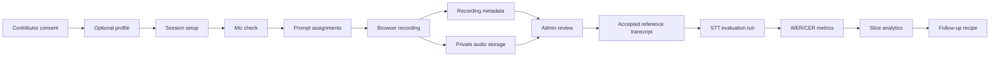
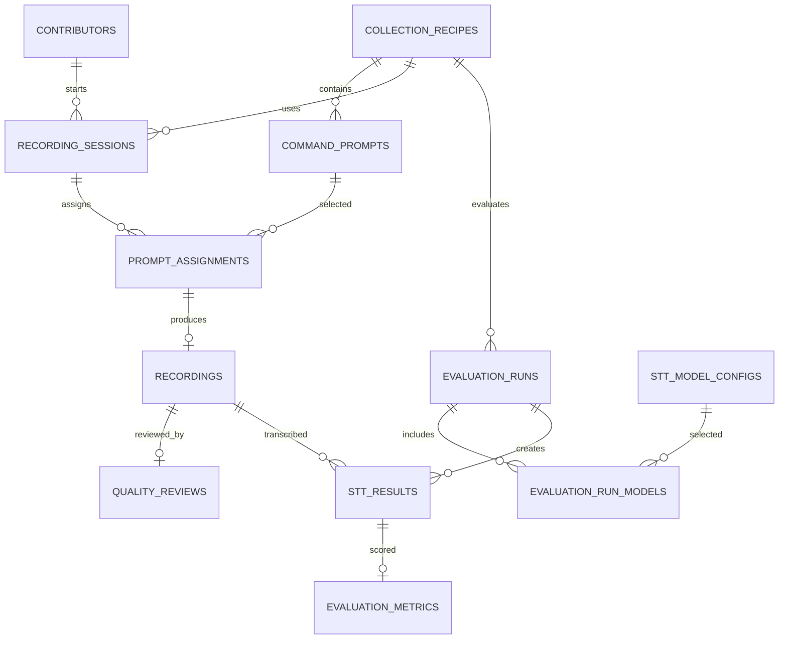

# CommandLoop

CommandLoop is a Next.js MVP for collecting spoken robot-style commands, reviewing recording quality, and evaluating speech-to-text models across useful data slices.

The app runs in two modes:

- Local demo mode: no Supabase credentials required. Data and uploaded audio live in the Node process for development and tests.
- Supabase mode: run the SQL migration, configure Supabase env vars, and replace the repository adapter with persistent Supabase calls as the production storage boundary.

## Stack

- Next.js App Router with TypeScript strict mode
- Tailwind CSS and small shadcn-style UI primitives
- Supabase Postgres schema and private `command-audio` storage bucket migration
- Zod, React Hook Form, Recharts, OpenAI JavaScript SDK
- Vitest unit tests and Playwright e2e tests

## Commands

```bash
corepack pnpm install
corepack pnpm dev
corepack pnpm lint
corepack pnpm typecheck
corepack pnpm test
corepack pnpm test:e2e
corepack pnpm build
corepack pnpm seed
```

Local admin login defaults to `commandloop-admin` when `ADMIN_PASSWORD` is absent. Set a real password before any shared deployment.

## Environment

Copy `.env.example` to `.env.local`.

```env
NEXT_PUBLIC_SUPABASE_URL=
NEXT_PUBLIC_SUPABASE_PUBLISHABLE_KEY=
NEXT_PUBLIC_SUPABASE_ANON_KEY=
SUPABASE_SERVICE_ROLE_KEY=
ADMIN_PASSWORD=
ADMIN_SESSION_SECRET=
OPENAI_API_KEY=
```

`OPENAI_API_KEY` is optional. Without it, OpenAI model configs are disabled and the deterministic mock STT provider remains available.

## Supabase Setup

1. Create a Supabase project.
2. Run `supabase/migrations/202607100001_initial_schema.sql`.
3. Confirm the `command-audio` bucket is private.
4. Store service-role and anon credentials in environment variables.
5. Keep `SUPABASE_SERVICE_ROLE_KEY` and `OPENAI_API_KEY` server-only.
6. For existing projects, also run `supabase/migrations/202607150001_add_input_validity.sql` to add the
   `recordings.input_validity` metadata field. New recordings default to `valid_command`; invalid examples can be
   labeled as `silence`, `background_noise`, `music`, `unintelligible`, or `unrelated_speech`.

The current local repository uses an in-process store so the app is runnable in this environment without a live database. The migration captures the production relational shape, indexes, foreign keys, and bucket settings.

Detailed setup and migration next steps are in `docs/supabase-setup.md`.

## Data Flow



## Seed Data Recipes

Local demo mode now starts with:

- `Robot Home Commands v1`: broad household robot commands across English, Japanese, and English-Japanese.
- `RobotCS Household EN-JA v1`: focused English-Japanese household code-switching prompts across word, phrase,
  sentence, and speech levels for RobotCS-style STT benchmarking.
- `Hospital Nurse Assistance v1`: draft clinical-support sample prompts.

The RobotCS prompt pack is also available at `examples/robot-cs-household-en-ja-v1.json` and from the admin recipe
import panel as a downloadable JSON file.

## P1 Failure Analysis

Evaluations > Metrics now includes an Error Confusion Explorer and an Invalid Input & Hallucination Queue. The explorer
uses normalized transcript alignment to rank substitutions, deletions, and insertions, then tags object, direction,
number/quantity, action, negation, safety, hesitation, and self-correction patterns. Each pattern keeps sample counts and
marks fewer than 10 samples as limited.

False actionable command rate means: among clips labeled with an `input_validity` other than `valid_command`, the STT
transcript still contains a recognizable robot action such as pick up, move, walk, open, close, stop, turn, place, pour,
clean, search, hand over, or equivalent Japanese command terms. The detector is intentionally transparent and modular in
`src/lib/stt/failure-analysis.ts`.

Flywheel now shows a Next Collection Priority Generator instead of generic ranked slices. The default rule is:

```text
priority_score = failure_rate * severity_weight * coverage_gap_weight
```

Default target coverage is 50 recordings per slice. Severity is 1 for harmless transcript errors, 2 for object/location/
number/direction errors, and 3 for action/negation/safety or false-actionable failures. Coverage gap increases priority
when a slice is below the target and drops once target coverage is reached.

Run `corepack pnpm test src/lib/stt/failure-analysis.test.ts` for focused failure-analysis coverage, or `corepack pnpm test`
for the full unit test suite.

## Schema Overview



## MVP Safeguards

- Admin session cookie is HTTP-only, signed, SameSite=Lax, and secure in production.
- Service credentials and OpenAI keys are never exposed to client components.
- Audio uploads validate MIME type and a 10 MB size limit.
- Review ground truth is distinct from displayed prompt text, contributor transcript, and model hypothesis.
- Audio playback is served through an authenticated endpoint, not permanent public URLs.
- Contributor withdrawal marks contributor data withdrawn and removes local demo audio objects.

Before a public production launch, strengthen CSRF protection with explicit anti-CSRF tokens, add durable rate limiting, complete a Supabase repository implementation, add audit logging, and define formal data-retention/delete workflows.

## Troubleshooting

- Microphone permission denied: check browser site permissions and use `http://localhost:3000` or HTTPS.
- No OpenAI models available: set `OPENAI_API_KEY`; otherwise use Mock Echo.
- Empty admin dashboard: complete contributor upload and review flow first.
- Playwright browser missing: run `corepack pnpm exec playwright install chromium`.
